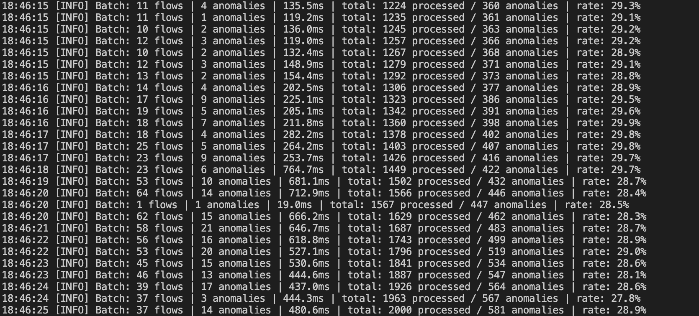
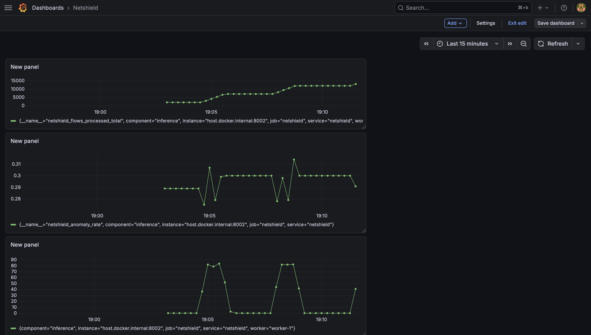
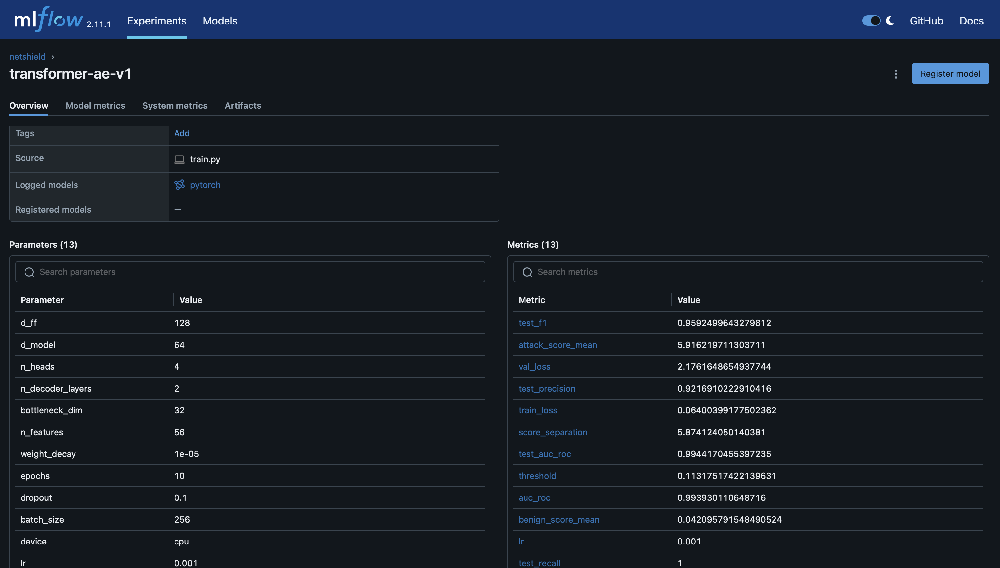
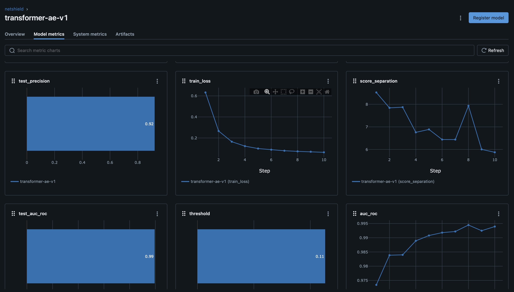
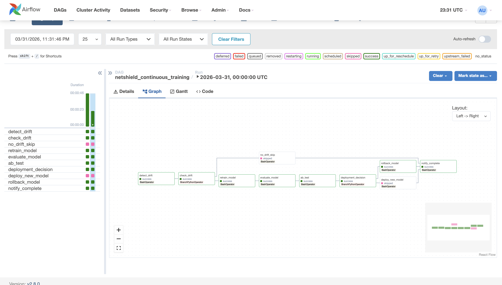

# NetShield — Real-Time Network Intrusion Detection System

A production-ready anomaly detection system that identifies malicious network traffic in real time. A Transformer autoencoder is trained exclusively on normal traffic — it learns what "normal" looks like and flags anything that deviates, including attack types it has never seen before.

## Results

| Metric | Value |
|---|---|
| AUC-ROC | 0.901 |
| Recall | 82.6% |
| Precision | 60.4% |
| Inference throughput | 4,123 flows/sec |
| Redis feature retrieval | 0.29ms |

**Per-attack detection rates:**

| Attack Type | Recall |
|---|---|
| SSH Brute Force | 100% |
| FTP Brute Force | 100% |
| DDoS HOIC | 99.98% |
| DoS GoldenEye | 100% |
| DoS Slowloris | 99% |
| Bot | 50% |
| Infiltration | 20% |

Test set metrics (stratified split, held out before training). Generalization was validated on a fully held-out day (Friday-16-02-2018) containing unseen attack types — holdout AUC: 0.94.

Bot and Infiltration are specifically designed to mimic normal traffic patterns — their low recall is a fundamental property of how these attacks behave at the network flow level, not a model failure.


## How It Works

Most intrusion detection systems are classifiers — they're trained on labeled examples of known attacks and learn to recognize those specific patterns. The problem is that new attack types emerge constantly. A classifier that has never seen a DDoS variant will simply miss it.
NetShield takes a different approach: unsupervised anomaly detection. The model is trained exclusively on normal (benign) network traffic. It learns to reconstruct what normal flows look like. At inference time, anything the model struggles to reconstruct — anything that deviates from learned normal patterns — gets flagged as anomalous.
This means NetShield can detect novel attack types it has never seen during training, which is validated by the 0.94 AUC on the held-out day containing completely unseen attack variants.
Each network flow is a vector of ~72 features extracted by CICFlowMeter: packet counts, byte rates, inter-arrival times, TCP flag counts, and ratio features engineered to be scale-invariant across days. A Transformer autoencoder processes these features using self-attention, which allows it to learn joint patterns across features — "when Flow Pkts/s is high AND ACK Flag Count is high AND Bwd Pkts/s is low, that combination is suspicious" — something a dense autoencoder treating features independently cannot capture.
The anomaly score is a blended reconstruction error: 0.7 × mean(per_feature_error) + 0.3 × max(per_feature_error). The mean component catches attacks that are slightly anomalous across many features. The max component catches attacks with extreme anomaly concentrated in a single feature. This blending was critical — see the Model Iterations section below.

## Model Iterations

The final model didn't come from a single training run. Each failure was diagnosed systematically.
Iteration 1 — Transformer autoencoder with StandardScaler
Problem: Poor cross-day generalization. The model trained well on Wednesday's data but performed poorly on Thursday's unseen attack types.
Diagnosis: StandardScaler computes mean and standard deviation per feature. Absolute feature values like Flow Bytes/s and Total Fwd Packets varied significantly across days — Wednesday's normal traffic had different scales than Thursday's. The scaler fitted on one day's statistics made Thursday's normal traffic look anomalous.
Attempted fix: Drop volatile absolute features for cross-day stability. This made things worse.
Why it made things worse: Per-feature signal analysis showed Flow Pkts/s had a 3,000x median ratio between attack and benign traffic. Those volatile features were the primary attack signal. Dropping them for "stability" destroyed the model's ability to detect attacks.
Real fix: Switch to QuantileTransformer. It maps feature values to their percentile rank in the training distribution, then outputs the corresponding normal quantile. It's rank-based — it doesn't care about absolute magnitudes, only relative ordering. Cross-day scale differences disappear because a flow in the 95th percentile of packet rate on Wednesday maps to the same scaled value as a flow in the 95th percentile on Thursday.
Iteration 2 — Isolation Forest
Result: AUC 0.53 — barely better than random.
Diagnosis: Isolation Forest anomaly scores compressed into a tiny range (0.42–0.45 for both benign and attack). It couldn't exploit the multi-feature coordinated signal that makes network attacks distinctive. The model was seeing individual feature values in isolation rather than their joint distribution.
Iteration 3 — Deep SVDD (Support Vector Data Description)
Result: AUC dropped below 0.50 — worse than random.
Diagnosis: Hypersphere collapse. All embeddings — both benign and attack — converged to the same point in the hypersphere. The loss went to near-zero but the model learned nothing useful. SVDD requires careful regularization to prevent this collapse, and the standard implementation doesn't handle it well on tabular data with this feature dimensionality.
Iteration 4 — Transformer autoencoder with QuantileTransformer, mean-MSE scoring
Result: AUC 0.857. Good overall but DDoS-HOIC recall was only 24% — nearly completely missed despite being one of the most common attack types.
Diagnosis: Decomposed reconstruction error per feature for HOIC vs benign flows. Found that Init_Fwd_Win_Byts had 225x more reconstruction error for HOIC flows than benign flows — a massive signal. But standard mean-MSE averages this across all 72 features, diluting a 225x signal to near-zero. The model was detecting the anomaly but the scoring function was hiding it.
Fix: Blended scoring — 0.7 × mean + 0.3 × max. The max component surfaces extreme single-feature anomalies that the mean buries. HOIC recall jumped from 24% to 99.98%.
Final model — Transformer autoencoder with QuantileTransformer + blended scoring
Result: AUC 0.901, holdout AUC 0.94.

## Data Challenges

The CSE-CIC-IDS2018 dataset is not clean out of the box.
CICFlowMeter bugs: The tool that extracts network flow features has a known division-by-zero bug. When a flow has zero duration, computing Flow Bytes/s = total_bytes / duration produces infinity. These appeared as inf values across rate columns and had to be replaced with 0. There were also rows with physically impossible negative values — negative packet counts and negative flow durations — which were collection artifacts and dropped entirely.
Cross-day distribution shift: Each day's traffic has different absolute scales even for normal traffic. A typical Wednesday might have higher overall packet rates than a Thursday due to different workloads. This is the core challenge for training a model that generalizes — the model must learn what "normal" looks like in a relative sense, not an absolute one. QuantileTransformer solves this by being rank-based.
Class imbalance: 78.3% of flows are benign, 21.7% are attacks. The imbalance itself isn't the problem — the autoencoder only trains on benign traffic, so class imbalance in the full dataset is irrelevant. The challenge is that rare attack types (SQL Injection: 87 flows, Brute Force-XSS: 230 flows) have very small test set samples, making per-class recall estimates noisy.
Volatile features: Many preprocessing guides for this dataset recommend dropping features like Flow Bytes/s, Flow Packets/s, and absolute packet counts as they vary too much across days. This is wrong for anomaly detection. These features carry the strongest attack signal — DDoS attacks are characterized by extreme packet rates, brute force attacks by abnormal connection counts. Dropping them destroys detection capability. The right solution is a robust scaler, not feature removal.
Feature engineering: 14 ratio features were engineered to complement the raw features: bytes_per_pkt, fwd_bwd_pkt_ratio, syn_per_pkt, iat_cv, etc. Ratios are inherently scale-invariant — forward_packets / backward_packets captures the asymmetry of a flow regardless of its absolute volume. A DDoS attack has extreme asymmetry that's consistent across days even when absolute counts vary.

## Architecture

```
Network flows
    → Kafka (network-flows topic)
    → Inference engine
        → Redis feature store (sub-ms cache)
        → QuantileTransformer preprocessing
        → Transformer autoencoder
        → Blended anomaly score (0.7 × mean + 0.3 × max reconstruction error)
    → Kafka (anomaly-scores topic)
    → BigQuery sink → Looker Studio dashboard
    → Prometheus → Grafana observability
```

**Continuous training loop (Airflow DAG, runs daily):**
```
detect_drift → check_drift → retrain_model → evaluate_model → ab_test → deploy/rollback
```

## Screenshots

### Kafka Streaming Inference
Real-time flow scoring with batch latency and anomaly rate.



### Grafana Dashboard
Live Prometheus metrics across inference workers.



### MLflow Experiment Tracking
AUC-ROC curve over training epochs across multiple runs.




### Airflow Continuous Training DAG
Full MLOps pipeline — drift detection, retraining, A/B testing, deployment.



### BigQuery Analytics
Detection rate by attack type queried from the live anomaly events table.


## Key Technical Decisions

**Why unsupervised anomaly detection over a classifier:** A classifier can only detect attack types it has seen during training. An autoencoder trained on normal behavior flags anything that deviates — including novel attacks never seen before. Critical for cybersecurity where new attack vectors emerge constantly.

**Why QuantileTransformer over StandardScaler:** StandardScaler failed on multi-day data because absolute feature values varied across days. QuantileTransformer is rank-based — it handles cross-day scale differences without removing informative features.

**Why blended scoring:** Standard mean-MSE reconstruction error missed DDoS-HOIC at 24% recall. Per-feature analysis showed `Init_Fwd_Win_Byts` had 225x more error for HOIC vs benign — diluted to nothing when averaged across 72 features. Blending 70% mean + 30% max captures both distributed and concentrated anomalies. HOIC recall jumped from 24% to 99.98%.

**Why Kafka and Redis:** Kafka moves data between services (pipe). Redis stores data for fast lookup within a service (cache). Kafka handles real-time routing at microsecond latency. Redis provides sub-millisecond feature retrieval and exactly-once deduplication via UUID tracking.

**Why Kafka and BigQuery:** Kafka is ephemeral and not queryable analytically. BigQuery stores every scored flow for historical analysis — "detection rate by attack type over the last week" is a BigQuery query, not a Kafka query.

## Dataset

**CSE-CIC-IDS2018** — Canadian Institute for Cybersecurity. Used in peer-reviewed academic research.

- 7.2M network flows across 10 days of traffic
- 80 raw features extracted by CICFlowMeter
- 14 attack types + benign traffic
- 78.3% benign / 21.7% attack
- 9 days training, 1 day held out for generalization testing

## Stack

| Category | Tools |
|---|---|
| Model | PyTorch (Transformer autoencoder) |
| Data | pandas, NumPy, scikit-learn (QuantileTransformer) |
| Streaming | Apache Kafka |
| Feature store / Dedup | Redis |
| Experiment tracking | MLflow |
| Orchestration | Apache Airflow |
| Observability | Prometheus, Grafana |
| Analytics | BigQuery, Looker Studio |
| Drift detection | scipy (KS test) |
| CI/CD | GitHub Actions |
| Containerization | Docker, Docker Compose |
| Testing | pytest |

## Project Structure

```
netshield/
├── src/
│   ├── data/
│   │   ├── eda.py                    # Exploratory data analysis
│   │   └── preprocess_multiday.py    # Full preprocessing pipeline
│   ├── model/
│   │   ├── model.py                  # Transformer autoencoder
│   │   ├── train.py                  # Training loop with MLflow
│   │   └── evaluate_cross_day.py     # Cross-day generalization evaluation
│   ├── serving/
│   │   ├── kafka_inference.py        # Kafka consumer + Prometheus metrics
│   │   ├── bigquery_sink.py          # BigQuery streaming sink
│   │   └── ab_testing.py             # Bayesian A/B testing
│   ├── features/
│   │   └── feature_store.py          # Redis feature store
│   └── monitoring/
│       └── drift_detector.py         # KS-test drift detection
├── dags/
│   └── netshield_ct_pipeline.py      # Airflow continuous training DAG
├── configs/
│   └── prometheus.yml                # Prometheus scrape config
├── artifacts/                        # Trained artifacts (threshold, feature meta)
├── outputs/                          # EDA plots, evaluation figures
├── docker-compose.yml                # Full stack: Kafka, Redis, Prometheus, Grafana, Airflow
└── requirements.txt
```

## Setup

```bash
# Clone
git clone https://github.com/sidd9981/NetShield.git
cd NetShield

# Virtual environment
python3 -m venv .venv
source .venv/bin/activate
pip install -r requirements.txt

# Start infrastructure
docker compose up -d

# Download dataset (CSE-CIC-IDS2018, public S3 bucket)
aws s3 cp --no-sign-request \
  's3://cse-cic-ids2018/Processed Traffic Data for ML Algorithms/Wednesday-14-02-2018_TrafficForML_CICFlowMeter.csv' \
  data/raw/

# Preprocess
python -m src.data.preprocess_multiday

# Train
python -m src.model.train

# Run inference
python -m src.serving.kafka_inference consume    # Terminal 1
python -m src.serving.kafka_inference produce    # Terminal 2
```